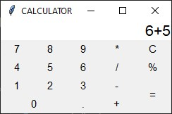
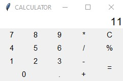
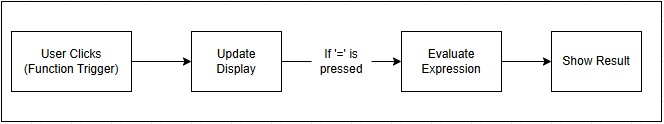

# Calculator-GUI

A simple yet functional GUI-based calculator built using Python's Tkinter library. This application allows users to perform basic arithmetic operations through an intuitive graphical interface.

## Features

* **Basic Arithmetic Operations**: Addition, subtraction, multiplication, and division.
* **Percentage Calculation**: Easily compute percentages.
* **Clear Functionality**: Reset the input field with a single click.

## Project Structure

```
Calculator-GUI/
├── calculator.py
└── README.md
```

* `calculator.py`: The main Python script containing the GUI implementation.
* `README.md`: This file.

## Prerequisites

* Python 3.x installed on your system.

## Setup and Usage

1. **Clone the Repository**:

   ```bash
   git clone https://github.com/Rasesh2005/Calculator-GUI.git
   cd Calculator-GUI
   ```

2. **Run the Application**:

   ```bash
   python calculator.py
   ```

   The calculator GUI should appear, ready for use.

## Application Overview

Upon launching the application, you'll see a calculator interface with buttons for digits (0-9), basic arithmetic operations (`+`, `-`, `*`, `/`), a percentage button (`%`), a clear button (`C`), and an equals button (`=`). Users can click these buttons to input expressions and compute results. <br>
  <br>


## Code Highlights

* **GUI Construction**: Utilizes Tkinter's `Frame`, `Button`, and `Entry` widgets to build the interface.
* **Event Handling**: Button clicks are managed that update the display or perform calculations.
* **Expression Evaluation**: The `eval()` function processes the input string to compute results. Percentage operations are handled by replacing `%` with `/100` before evaluation.
* **Error Handling**: Invalid inputs trigger a warning message box, ensuring the application doesn't crash unexpectedly.

